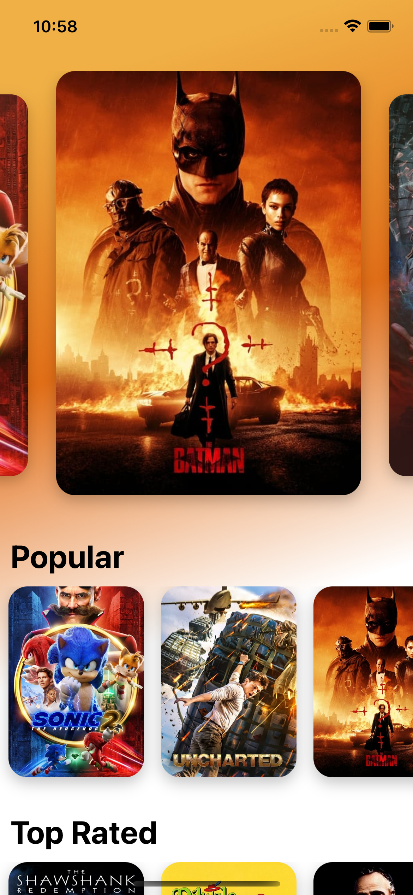
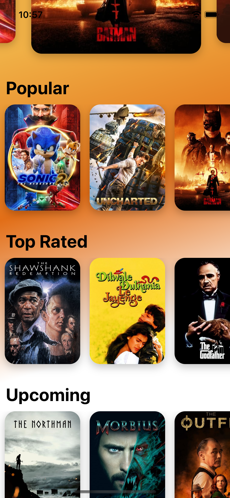
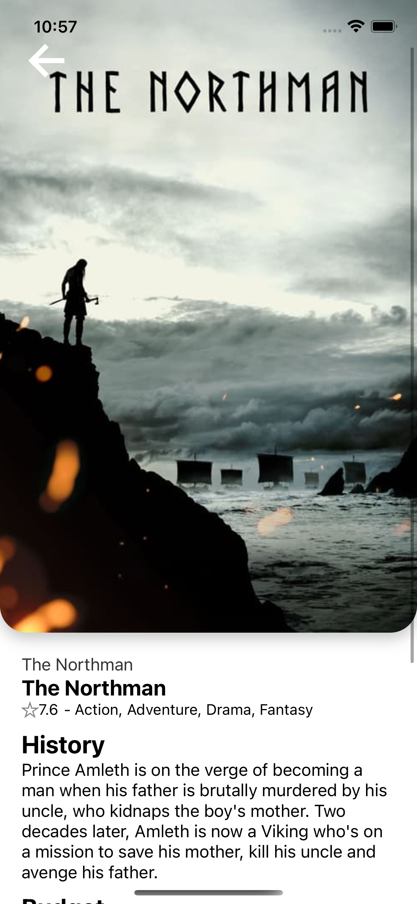
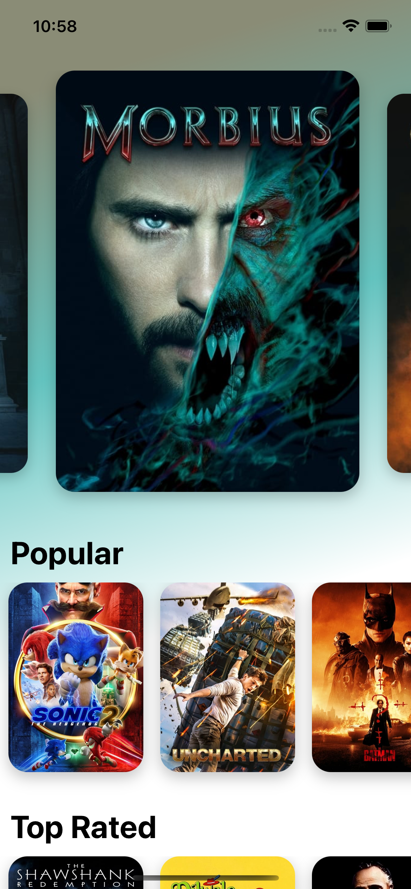
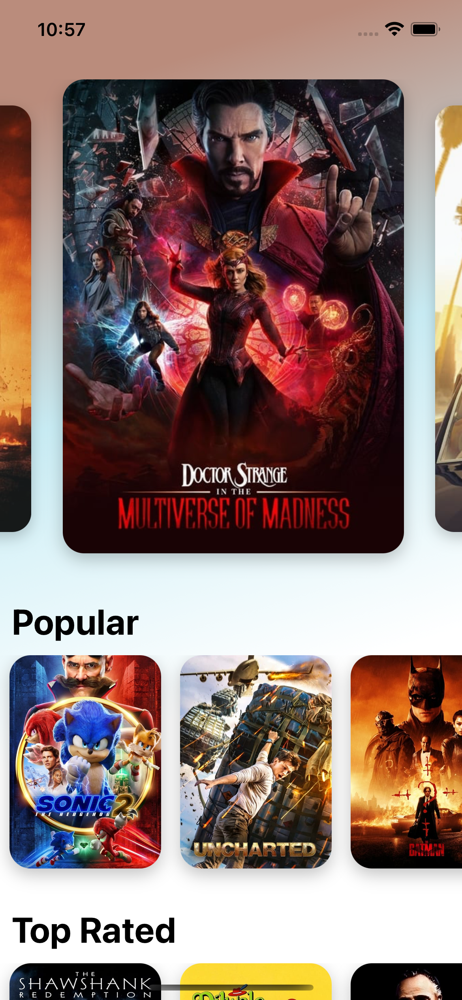
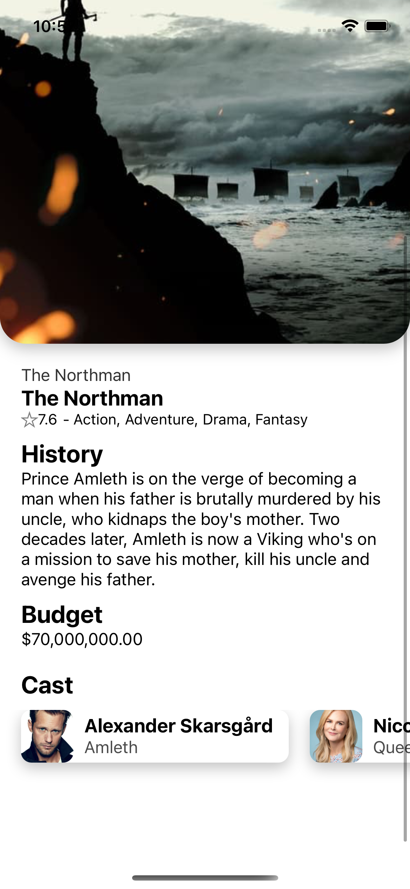

# Franklin Movies App

React Native Crossplatform movile app using The Movie DB API.

Technologies used:

- TypeScript
- Context
- Custom Hooks
- React Native Animation
- Navigation
- Linear gradient

In this project I focused on creating a beautiful UI using dynamic gradients colors according to each movie poster and a carousel with animation.

## Screenshots

  

## Instructions

To run the project you need to create a .env file and add the API key for movie DB App

MOVIE_DB_API_KEY=YOUR_API_KEY
